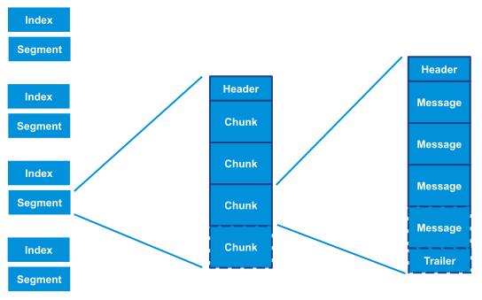
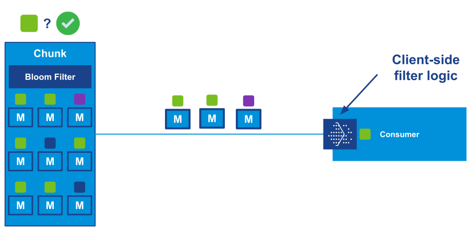

<!-- diagrams: https://drive.google.com/drive/folders/1ViVE309sdIcZyd23qMfF_m5hq2TQfum-?usp=drive_link -->

A [previous post](/blog/2023/10/16/stream-filtering) gave an introduction to stream filtering, a new and exciting feature in RabbitMQ 3.13.
In this post we cover the internals of stream filtering.
Knowing the design and implementation will help you to configure and use stream filtering in the most optimal way for your use cases.

_Note: RabbitMQ 3.13 is in development at the time of writing_

<!-- truncate -->
## Concepts

The idea of stream filtering is to provide a first level of efficient filtering on the broker side, _without_ the broker needing to interpret messages.
This way consumers that need only a subset of the stream do not need to get all the data and handle all the filtering by themselves.
This can drastically reduce the data transmitted to consumers.

With filtering a _filter value_ can be associated to each message.
It can be geographical information, like the region of the world each message comes from, as illustrated in the next figure:


So our stream has 1 `AMER` (green) message, 1 `APAC` (dark blue) message, 2 `EMEA` (purple) messages, then 2 `AMER` messages.

### Message Publishing

Publishers get to associate each outbound message with its filter value:


In the figure above, the publisher publishes 1 `AMER` (green) message and 2 `EMEA` (purple) messages that will be added to the stream.

### Message Consuming

When a consumer subscribes, it can specify one or several filter values and the broker is expected to dispatch only the messages with this or these filter value(s).
We will see soon this is a bit different in practice but this is enough to understand the concepts.

In the figure below, the consumer at the top specified it only wants `AMER` (green) messages and the broker dispatches only those.
Same thing for the consumer in the middle with `EMEA` messages and the consumer at the bottom with `APAC` messages.


That's it for the concepts, let's discover the implementation details now.

## Structure of a Stream

We need to know how a stream is structured to understand stream filtering internals.
A stream is a directory with segment files in it.
Each segment file has an associated index file (used to know where to attach a consumer at a given offset in the segment file, among others).
Having several "small" segment files is better than having a large monolithic file for the whole stream: it is for example more efficient and safer to delete "old" segment files to truncate the stream than removing the beginning of a large file.

A segment file is made of chunks that contain messages.
The number of messages in a chunk depends on the ingress rate (high ingress rate means many messages in a chunk, low ingress rate means fewer messages in a chunk).
The number of messages in a chunk varies from a few (even 1) to a few thousands.

What is the deal with chunks?
Chunks are the unit of work in streams: they are used for replication and, more importantly for our topic, for _consumer delivery_.
The broker sends chunks to consumers, one at a time, using the [`sendfile` system call](https://man7.org/linux/man-pages/man2/sendfile.2.html) (to send a whole chunk from the file system to the network socket, without copying the data into userspace).

The following figure illustrates the structure of a stream:



With this in place, let's see how the broker can know whether to dispatch a chunk or not.

## Filtering On The Broker Side

Imagine we have a consumer that wants only `AMER` (green) messages.
When a broker is about to dispatch a chunk, it needs to know whether the chunk contains `AMER` messages or not.
If it does, it can send the chunk to the consumer, if it does not, the broker can skip the chunk, move on to the next one, and re-iterate.

Each chunk has a header that can contain a _Bloom filter_, which tells the broker whether the chunk contains a message with a given filter value.
A [Bloom filter](https://en.wikipedia.org/wiki/Bloom_filter) is _a space-efficient probabilistic data structure, used to test whether an element is a member of a set_.
In our example the set contains `AMER`, `EMEA`, and `APAC` and the element is `AMER`.

The following figure illustrates the broker-side filtering process for our 3 chunks:


As shown in the figure above, the filter can return false positives, that is chunks that do not contain messages with the expected filter value(s).
This is normal, as Bloom filters are probabilistic.
They do not return false negative though: if the filter says there is no `AMER` (green) messages, we can be sure it is true.
We have to live with this uncertainty: we may dispatch some chunks for nothing sometimes, but it is better than dispatching _all_ the chunks.

Something certain is that a consumer can receive messages it does not want: look at our first chunk on the left, it contains `AMER` (green) messages that the consumer asked for, but also `EMEA` (purple), and `APAC` (dark blue) messages.
This is why there must be filtering on the client side as well.

## Filtering On The Client Side

The broker handles a first level of filtering when delivering messages, but as the unit of delivery is the chunk, the consumer can still receive messages it does not want.
So the client must do some filtering as well, which obviously must be consistent with the filter value(s) set at subscription time.

The following figure illustrates a consumer that wants only `AMER` (green) messages and that must do a last step of filtering:



Let's see how this translates into application code.

## API Examples

Filtering is not intrusive and can be handled as a cross-cutting concern, minimizing the impact on application code.
Here is how to set the logic to extract the filter value from a message when declaring a producer with the [stream Java client](https://github.com/rabbitmq/rabbitmq-stream-java-client/) (`filterValue(Function<Message,String>)` method):

```java
Producer producer = environment.producerBuilder()
  .stream("invoices")
  .filterValue(msg -> msg.getApplicationProperties().get("region").toString())  
  .build();
```

On the consuming side, the stream Java client provides the `filter().values(String... filterValues)` method to set the filter value(s) and the `filter().postFilter(Predicate<Message> filter)` method to set the client-side filtering logic.
Both methods must be called when declaring the consumer:

```java
Consumer consumer = environment.consumerBuilder()
  .stream("invoices")
  .filter()
    .values("AMER")  
    .postFilter(msg -> "AMER".equals(msg.getApplicationProperties().get("region")))  
  .builder()
  .messageHandler((ctx, msg) -> {
    // message processing code
  })
  .build();
```

As you can see, filtering does not change the publishing and consuming code, just the declaration of producers and consumers.

Let's see now how to configure stream filtering in the most appropriate way for a use case.

## Stream Filtering Configuration

The [first post on stream filtering](/blog/2023/10/16/stream-filtering#trying-it-out) provided some numbers (about 80% bandwidth savings with filtering compared to no filtering).
Benefits of stream filtering depend heavily on the use case: ingress rate, cardinality and distribution of filter values, but also _filter size_.
The larger the filter, the better (error rate gets smaller).
It is possible to set a value between 16 and 255 bytes for the size of the filter used in chunks, the default being 16 bytes.

The stream Java client provides the `filterSize(int)` method to set the filter size when creating a stream (it sets the `stream-filter-size-bytes` parameter internally):

```java
environment.streamCreator()
  .stream("invoices")
  .filterSize(32)
  .create()
```

How to estimate the size of the filter?
There are many Bloom filter calculators available online.
The parameters are the number of hash functions (2 for RabbitMQ stream filtering), the number of expected elements, the error rate, and the size.
You usually have an idea of the number of elements, so you need to find a trade-off between the error rate and the filter size.

Here are some examples:

* 10 values, 16 bytes => 2 % error rate
* 30 values, 16 bytes => 14 % error rate
* 200 values, 128 bytes => 10 % error rate

So, the larger the filter, the better?
Not exactly: even though a Bloom filter is very efficient in terms of storage, as it does not store elements, just whether elements are in the set, the filter size is pre-allocated.
If you set the filter size to 255 and each chunk contains at least one message with a filter value, there will be 255 bytes allocated in each chunk header.
This is fine if chunks contain many large messages, as the filter size is negligible compared to the chunk size.
But with a degenerated case like a single-message chunk with a 10-byte message and a 10-byte filter value, you end up with a filter larger than the actual data.

You'll have to experiment with your own use cases to estimate the impact of the filter size on your stream size.
The [first post on stream filtering](/blog/2023/10/16/stream-filtering#trying-it-out) provides a trick to estimate the size of a stream with Stream PerfTest (read the whole stream without filtering and consult the `rabbitmq_stream_read_bytes_total` metric).

## Bonus: Stream Filtering On AMQP

Even though the preferred way to access streams is the stream protocol, other protocols are supported, like AMQP.
Stream filtering is also supported with any AMQP client library:

* Declaration: set the `x-queue-type` argument to `stream` and use the `x-stream-filter-size-bytes` to set the filter size when you declare a stream.
* Publishing: use the `x-stream-filter-value` header to set the filter value for outbound messages.
* Consuming: use the `x-stream-filter` consumer argument to set the expected filter value(s) (string or array of strings) and optionally the `x-stream-match-unfiltered` consumer argument to receive messages without any filter value as well (default is `false`). Client-side filtering is still necessary!

## Wrapping Up

This blog post provided an in-depth description of stream filtering in RabbitMQ 3.13.
It complements a [first post](/blog/2023/10/16/stream-filtering) that gives an introduction on the usage and a demonstration of stream filtering.

Stream filtering is easy to use and to benefit from, but some knowledge on the internals can be useful to optimize its usage, especially for tricky use cases.
Remember that client-side filtering is necessary and must be consistent with the configured filter value(s).
This is usually straightforward to implement.
It is also possible to set the filter size in the most appropriate way for a given use case.


